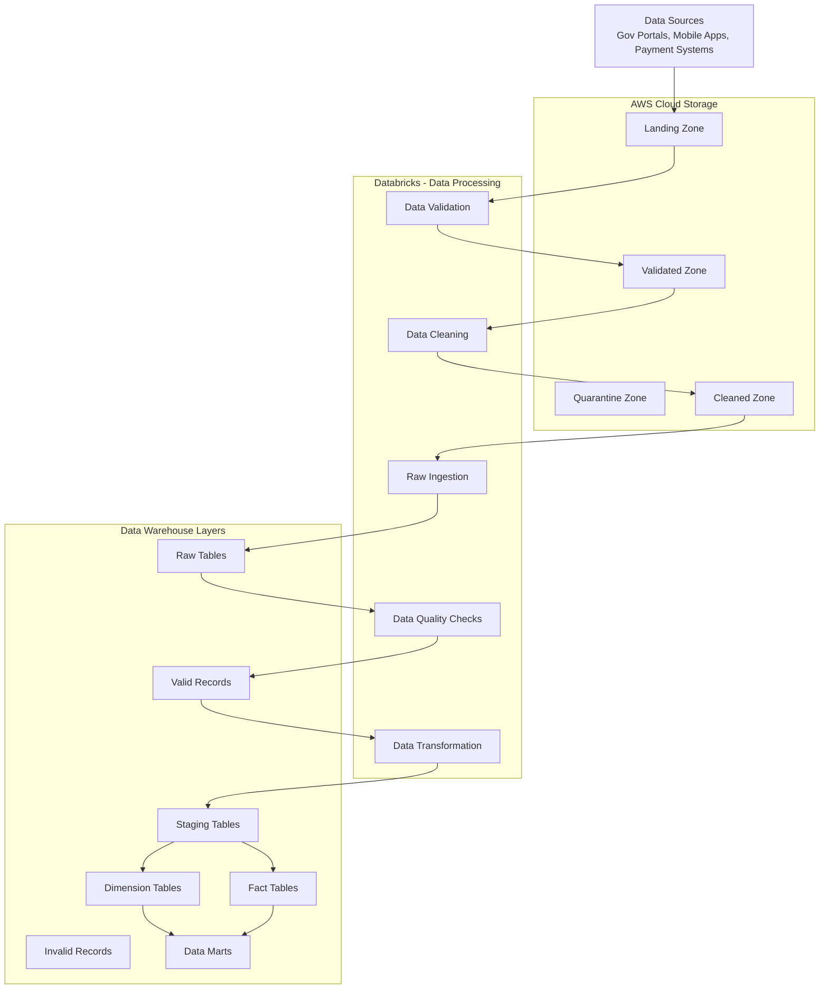
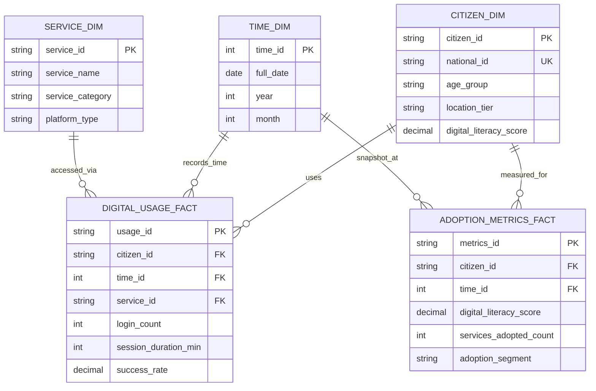

# Digital Adoption Data Warehouse - Complete Documentation

## 1. Architecture Overview

## 2. Data Dictionary Tables

### Dimension Tables

#### CITIZEN_DIM
| Column Name | Data Type | Primary Key | Foreign Key | Description | Constraints |
|-------------|-----------|-------------|-------------|-------------|-------------|
| citizen_id | VARCHAR(20) | ✅ | | Unique surrogate identifier | NOT NULL, UNIQUE |
| national_id | VARCHAR(20) | | | Government ID number | NOT NULL, UNIQUE |
| age_group | VARCHAR(10) | | | Categorized age range | CHECK: '18-25','26-35','36-45','46-55','55+' |
| gender | VARCHAR(10) | | | Demographic gender | CHECK: 'Male','Female','Other' |
| location_tier | VARCHAR(15) | | | Geographic region classification | CHECK: 'Urban','Suburban','Rural' |
| education_level | VARCHAR(20) | | | Highest education completed | CHECK: 'Primary','Secondary','Diploma','Degree','Postgrad' |
| digital_literacy_score | DECIMAL(3,1) | | | Proficiency rating 1-10 | CHECK: >=1 AND <=10 |
| registration_date | DATE | | | First digital service usage | NOT NULL |

#### TIME_DIM
| Column Name | Data Type | Primary Key | Foreign Key | Description | Constraints |
|-------------|-----------|-------------|-------------|-------------|-------------|
| time_id | INTEGER | ✅ | | Date in YYYYMMDD format | PRIMARY KEY |
| full_date | DATE | | | Calendar date | NOT NULL |
| year | INTEGER | | | Year component | CHECK: >= 2020 |
| quarter | INTEGER | | | Quarter number | CHECK: 1-4 |
| month | INTEGER | | | Month number | CHECK: 1-12 |
| week | INTEGER | | | Week number | CHECK: 1-53 |
| day_of_week | VARCHAR(10) | | | Name of weekday | CHECK: 'Monday' to 'Sunday' |
| is_weekend | BOOLEAN | | | Weekend indicator | DEFAULT FALSE |

#### SERVICE_DIM
| Column Name | Data Type | Primary Key | Foreign Key | Description | Constraints |
|-------------|-----------|-------------|-------------|-------------|-------------|
| service_id | VARCHAR(15) | ✅ | | Unique service identifier | PRIMARY KEY |
| service_name | VARCHAR(50) | | | Official service name | NOT NULL |
| service_category | VARCHAR(30) | | | Service classification | CHECK: 'Payment','Information','Application','Notification' |
| platform_type | VARCHAR(20) | | | Access platform | CHECK: 'Web','Mobile','Kiosk' |
| complexity_level | VARCHAR(15) | | | Usage difficulty rating | CHECK: 'Basic','Intermediate','Advanced' |

### Fact Tables

#### DIGITAL_USAGE_FACT
| Column Name | Data Type | Primary Key | Foreign Key | Description | Constraints |
|-------------|-----------|-------------|-------------|-------------|-------------|
| usage_id | VARCHAR(30) | ✅ | | Unique usage record identifier | PRIMARY KEY |
| citizen_id | VARCHAR(20) | | ✅ CITIZEN_DIM | Citizen reference | FOREIGN KEY |
| time_id | INTEGER | | ✅ TIME_DIM | Date reference | FOREIGN KEY |
| service_id | VARCHAR(15) | | ✅ SERVICE_DIM | Service reference | FOREIGN KEY |
| login_count | INTEGER | | | Daily login attempts | DEFAULT 0, CHECK: >=0 |
| session_duration_min | INTEGER | | | Total usage time in minutes | CHECK: >=0 |
| features_used | INTEGER | | | Number of features accessed | DEFAULT 0 |
| success_rate | DECIMAL(5,2) | | | Transaction success percentage | CHECK: >=0 AND <=100 |

#### ADOPTION_METRICS_FACT
| Column Name | Data Type | Primary Key | Foreign Key | Description | Constraints |
|-------------|-----------|-------------|-------------|-------------|-------------|
| metrics_id | VARCHAR(30) | ✅ | | Unique metrics record | PRIMARY KEY |
| citizen_id | VARCHAR(20) | | ✅ CITIZEN_DIM | Citizen reference | FOREIGN KEY |
| time_id | INTEGER | | ✅ TIME_DIM | Snapshot date | FOREIGN KEY |
| digital_literacy_score | DECIMAL(3,1) | | | Overall proficiency score | CHECK: 1-10 |
| services_adopted_count | INTEGER | | | Number of services used | DEFAULT 0 |
| adoption_segment | VARCHAR(20) | | | User segmentation | CHECK: 'Beginner','Intermediate','Advanced','Expert' |
| frequency_score | DECIMAL(4,2) | | | Usage frequency rating | CHECK: 0-100 |

## 3. Schema Relationships

## 4. Key Relationships Summary

| Relationship | From Table | To Table | Cardinality | Purpose |
|--------------|------------|----------|-------------|---------|
| Citizen Usage | CITIZEN_DIM | DIGITAL_USAGE_FACT | One-to-Many | Track individual service usage |
| Time Tracking | TIME_DIM | DIGITAL_USAGE_FACT | One-to-Many | Analyze trends over time |
| Service Access | SERVICE_DIM | DIGITAL_USAGE_FACT | One-to-Many | Monitor service adoption |
| Adoption Metrics | CITIZEN_DIM | ADOPTION_METRICS_FACT | One-to-Many | Measure digital literacy progression |
| Time Snapshots | TIME_DIM | ADOPTION_METRICS_FACT | One-to-Many | Track adoption metrics over time |
